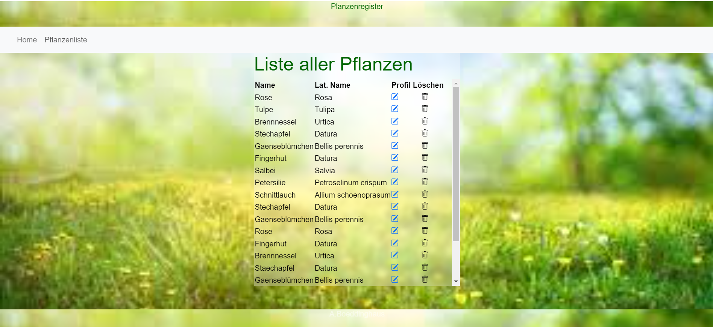
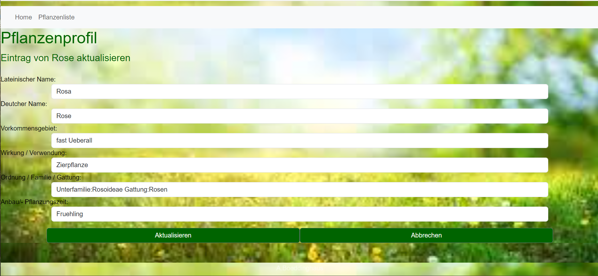

Frontend06
This project was generated with Angular CLI version 17.2.3.

Development server
Run ng serve for a dev server. Navigate to http://localhost:4200/. The application will automatically reload if you change any of the source files.

Code scaffolding
Run ng generate component component-name to generate a new component. You can also use ng generate directive|pipe|service|class|guard|interface|enum|module.

Build
Run ng build to build the project. The build artifacts will be stored in the dist/ directory.

Running unit tests
Run ng test to execute the unit tests via Karma.

Running end-to-end tests
Run ng e2e to execute the end-to-end tests via a platform of your choice. To use this command, you need to first add a package that implements end-to-end testing capabilities.

Further help
To get more help on the Angular CLI use ng help or go check out the Angular CLI Overview and Command Reference page.

Das Frontend wurde mit Angular entwickelt.
Es läuft auf http://localhost:4200/. Zum Starten des Frontends entweder ng serve eingeben oder oben auf das grüne Dreieck klicken.
Der Frontendbranch, der aktuell ist, ist tryStyling.

Das Backend wurde mit Node.js entwickelt.
http://localhost:4000/  Zum Starten des Backends npm rum watch eingeben.
Der Backendbranch, der aktuell ist, ist tutorial. 

Datenbank
Die Datenbank ist eine Postgresql Datenbank (https://ocean.f4.htw-berlin.de/) und mit dem Backend verbunden. 
die Datenbank wid mit einem Skript aus dem Backend über postman mit GET http://localhost:4000/init  befüllt. 

Die Homepage elraube es einem auf die Liste zuzugreifen.        http://localhost:4200/

Die Pflanzenliste zeigt von allen Pflanzen in der Datenbank die deutschen und die lateinischen/wissenschaftlichen Namen.  In der Liste ist es möglich Einträge zu löschen oder sich alle Informationen zu einer Pflanze anzeigen zu lassen.        http://localhost:4200/plant

Ein Pflanzenprofil, welches alle Informationen über die Pflanze anzeigt. Dort ist es auch möglich die Informationen anzupassen / zu verändern.            http://localhost:4200/plant/31

        

